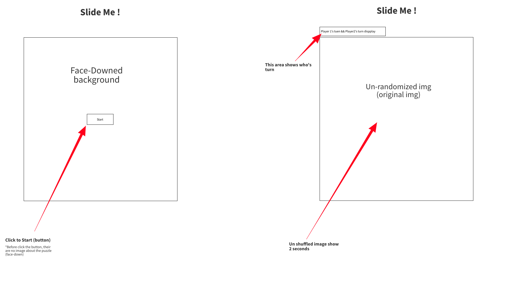

# Slide Me! 

## Overview
-------------------
- This game(Slide Me!) based on a slide image puzzle, and two players take each turn and move the shuffled image pieces to make complete image. 
- The overview of the Slide me! This game needs to use many materials that we learned from the past two weeks, and this project also helps me cover many class materials that I need to practice. 
  

## Game rules
-------------------
- When the game starts, the original image of the picture shows two seconds.
- Each player move(slide) the piece of the puzzle in each tern.
- When one of the players matches the last part of the puzzle (shuffled image), player x is the game winner.
 

## Wireframe
-------------------

## MVP
-------------------
- make a minimum 4x4 size table. 
- need a covered (face-down) image at the beginning of the game.
- when the game start, the original image must display for players.
- image needs to be shuffled after the game starts.
- drag or slide function need for changing the order of the piece of the file.

## Stratch Goal
-------------------
-	The pieces of the image slide smoothly.
-	The top bar needs to show who’s turn information.
-	After finish, the game-winner needs to be pop-up.
-	Add some sound and animation to the game.
-	CSS (background img, font-family from google font, title animation)
